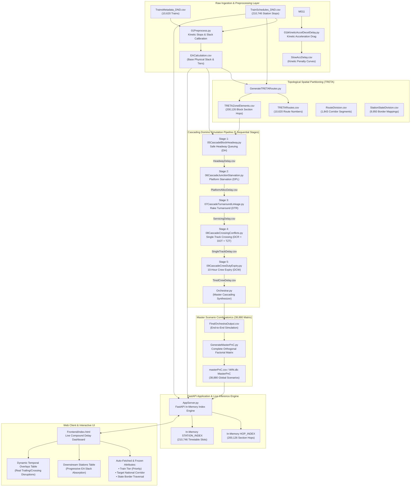
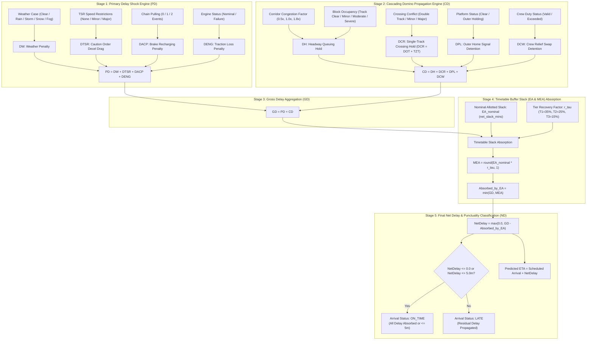
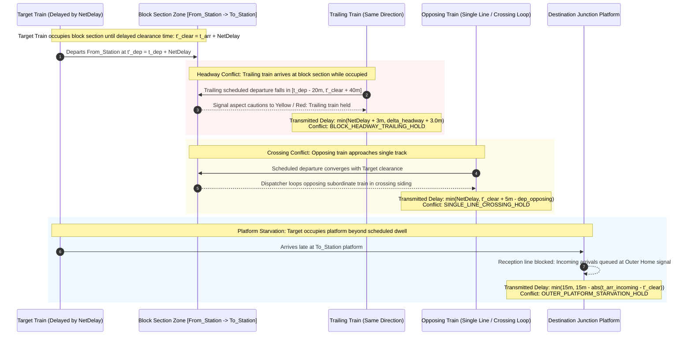
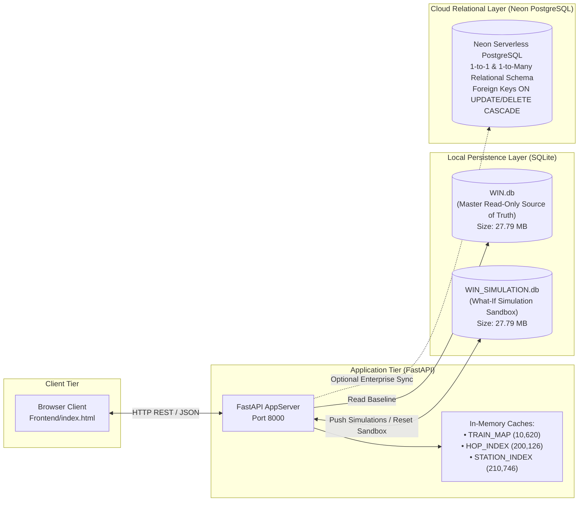

# Indian Railways Compound Delay & Segment Engine: System Architecture, Diagrams, Mathematical Formulations, and Database Catalog

This document serves as the comprehensive technical reference for the **Indian Railways Compound Delay & Segment Engine**. It consolidates all system architecture diagrams, mathematical formulas used across every operational disturbance case, and the complete catalog of relational databases, physical files, and their exact computational utilizations.

---

## 1. System Architecture & Workflows

### 1.1. End-to-End System & Pipeline Architecture



---

### 1.2. 5-Stage Mathematical Compound Delay Resolution Flow



---

### 1.3. Spatial-Temporal Treta Segment & Dynamic Overlays Engine



---

### 1.4. Database Multi-Tier Sandbox & Persistence Topology



---

## 2. Mathematical Formulations Across All Operational Instances

### 2.1. Primary Disturbance Shock Layer ($PD$)

Primary delays are localized, exogenous initial shocks caused by meteorological conditions, track engineering constraints, passenger disruptions, and traction failures.

$$\mathbf{PD} = D_W + D_{TSR} + D_{ACP} + D_{ENG}$$

#### Parameter Breakdown & Value Lookup:

| Disturbance Instance | Case Code / State | Value Formula ($\text{mins}$) | Physical & Operational Rationale |
| :--- | :--- | :---: | :--- |
| **Weather Penalty ($D_W$)** | `Clear` | $0.0$ | Nominal atmospheric conditions; zero visibility drag. |
| | `Heavy_Rain` | $+12.0$ | Railhead adhesion reduction; monsoon caution speeds. |
| | `Thunderstorm` | $+18.0$ | Overhead traction oscillation; lightning signaling protection. |
| | `Snow` | $+22.0$ | Sub-zero points freezing; track clearance crawling. |
| | `Fog` | $+35.0$ | Severe fog visibility restriction; detonator placement crawl ($<60\text{ km/h}$). |
| **TSR Speed Restriction ($D_{TSR}$)** | `None` | $0.0$ | Full permissible route speed (booked MPS). |
| | `Minor` | $+8.0$ | 1–2 caution orders ($30\text{ km/h}$ / $45\text{ km/h}$) with deceleration/acceleration curves. |
| | `Major` | $+24.0$ | Heavy engineering ballast renewal block ($20\text{ km/h}$ speed clamp over $10+\text{ km}$). |
| **Alarm Chain Pulling ($D_{ACP}$)** | `0_Events` | $0.0$ | Uninterrupted pneumatic train pipe integrity. |
| | `1_Event` | $+15.0$ | Emergency brake application, driver/guard inspection, brake resetting & air recharging. |
| | `2_Events` | $+30.0$ | Repeated passenger brake chain activation ($2 \times 15.0\text{ mins}$). |
| **Locomotive Traction ($D_{ENG}$)** | `Nominal` | $0.0$ | Full rated horsepower and tractive effort. |
| | `Failure` | $+15.0$ | Traction motor isolation / pantograph trip / fault clearing and loco reset. |

---

### 2.2. Kinetic Acceleration & Deceleration Braking Layer ($D_K$)

Before calculating timetable buffer slack, every scheduled halt incurs physical kinetic time loss from deceleration and acceleration:

$$D_K = (N_{\text{halts}} - 1) \cdot k_{\tau} + k_{\tau}$$

Where:
* $N_{\text{halts}}$: Total count of scheduled intermediate halts across the route.
* $k_{\tau}$: Kinetic stopping and starting penalty calibrated by train priority tier $\tau$:
  $$k_{\tau} = \begin{cases} 1.85\text{ mins}, & \tau = \text{T1\_PREMIUM} \quad (\text{Distributed Power Unit / EMU fast braking}) \\ 2.15\text{ mins}, & \tau = \text{T2\_SUPERFAST} \quad (\text{WAP-7 / WAP-5 Air-Brake Rakes}) \\ 2.35\text{ mins}, & \tau = \text{T3\_EXPRESS} \quad (\text{Heavy 24-Coach ICF / Conventional Rakes}) \end{cases}$$

#### Ideal Running Time ($T_{\text{ideal}}$):
$$T_{\text{ideal}} = \min\left(0.88 \cdot T_{\text{duration}},\, \frac{L_{\text{total}}}{V_{\tau}} \cdot 60\right)$$

Where $L_{\text{total}}$ is the total route distance ($\text{km}$), and $V_{\tau}$ is commercial cruising velocity:
$$V_{\tau} = \begin{cases} 90.0\text{ km/h}, & \tau = \text{T1\_PREMIUM} \\ 68.0\text{ km/h}, & \tau = \text{T2\_SUPERFAST} \\ 55.0\text{ km/h}, & \tau = \text{T3\_EXPRESS} \end{cases}$$

#### Gross Physical Travel Time ($T_{\text{physical}}$):
$$T_{\text{physical}} = T_{\text{ideal}} + \sum_{i=1}^{N_{\text{halts}}} t_{\text{dwell}, i} + D_K$$

---

### 2.3. Secondary Cascading Domino Shock Layer ($CD$)

Secondary delays are network-transmitted knock-on ripple effects propagated through constrained physical infrastructure.

$$\mathbf{CD} = D_H + D_{CR} + D_{PL} + D_{CW}$$

Where:
* $D_H$: Block section headway queuing detention.
* $D_{CR}$: Single-track crossing conflict and junction convergence delay ($D_{CR} = D_{OT} + T_{ZT}$).
* $D_{PL}$: Terminal and junction platform starvation detention.
* $D_{CW}$: 10-hour crew duty timeout replacement delay.

#### 1. Block Section Headway Queuing ($D_H$):
$$D_H = \max\Big(D_{H, \text{base}},\, D_{\text{occ}},\, D_{\text{eng\_ripple}}\Big)$$

Where:
* Base traffic congestion headway:
  $$D_{H, \text{base}} = \text{round}(3.0 \cdot \gamma_{\text{congestion}},\, 1)$$
  $$\gamma_{\text{congestion}} = \begin{cases} 0.5, & \text{None (Free Section)} \\ 1.0, & \text{Low (Nominal Corridor Traffic)} \\ 1.8, & \text{High (Saturated Corridor Squeeze)} \end{cases}$$
* Preceding block occupancy penalty ($D_{\text{occ}}$):
  $$D_{\text{occ}} = \begin{cases} 0.0\text{ mins}, & \text{Track\_Clear} \\ 5.0\text{ mins}, & \text{Preceding\_Delayed\_Minor} \\ 10.0\text{ mins}, & \text{Preceding\_Delayed\_Moderate} \\ 20.0\text{ mins}, & \text{Preceding\_Delayed\_Severe} \end{cases}$$
* Engine ripple drag: $D_{\text{eng\_ripple}} = 12.5\text{ mins}$ if locomotive failure occurs, else $0.0\text{ mins}$.

#### 2. Single-Track Crossing & Priority Precedence Conflict ($D_{CR} = D_{OT} + T_{ZT}$):
$$D_{CR} = \text{round}\Big(D_{\text{crossing\_base}} \cdot \kappa_{\tau},\, 1\Big)$$

Where:
* $D_{\text{crossing\_base}} = \begin{cases} 0.0\text{ mins}, & \text{Double\_Quad\_Track (Clear Directional Line)} \\ 8.0\text{ mins}, & \text{Minor\_Crossing\_Wait (Short Tokenless Block Wait)} \\ 25.0\text{ mins}, & \text{Major\_Crossing\_Wait (Extended Single-Line Crossing Loop Detention)} \end{cases}$
* $\kappa_{\tau}$ is the Tier Dispatch Yield Factor:
  $$\kappa_{\tau} = \begin{cases} 0.4, & \tau = \text{T1\_PREMIUM} \quad (\text{Highest priority; rarely held in crossing loop}) \\ 1.0, & \tau = \text{T2\_SUPERFAST} \quad (\text{Balanced dispatch precedence}) \\ 1.5, & \tau = \text{T3\_EXPRESS} \quad (\text{Subordinated; looped to clear higher-tier trains}) \end{cases}$$

#### 3. Platform Availability & Outer Home Signal Starvation ($D_{PL}$):
$$D_{PL} = \begin{cases} 0.0\text{ mins}, & \text{Platform\_Available (Direct Reception Line Clear)} \\ 15.0\text{ mins}, & \text{Outer\_Holding (Platform Berths Starved; Held at Outer Home Signal)} \end{cases}$$

#### 4. Crew Duty Expiry Timeout ($D_{CW}$):
Indian Railways Running Crew regulations strictly enforce an 8-to-10 hour maximum continuous driving window.
$$D_{CW} = \begin{cases} 0.0\text{ mins}, & \text{Duty\_Valid (Loco Pilot & Guard within 10-Hour Window)} \\ 45.0\text{ mins}, & \text{Duty\_Exceeded (Train Halted; Relief Crew Called & Brake Continuity Test Performed)} \end{cases}$$

---

### 2.4. Gross Accumulated Delay ($GD$)

$$\mathbf{GD} = PD + CD = (D_W + D_{TSR} + D_{ACP} + D_{ENG}) + (D_H + D_{CR} + D_{PL} + D_{CW})$$

---

### 2.5. Timetable Buffer Slack (EA & MEA) Absorption

Indian Railways working timetables allocate built-in cushion time known as **Extra Allotted Time (EA)** or **Net Slack** (`net_slack_mins`). This cushion acts as an operational sponge to absorb cumulative gross delays before terminal arrival.

#### Maximum Usable Extra Time Allotted ($MEA$):
$$MEA = \text{round}\Big(EA_{\text{nominal}} \cdot r_{\tau},\, 1\Big)$$

Where:
* $EA_{\text{nominal}}$: Calibrated timetable cushion (`net_slack_mins` from `EACalculation.csv`).
* $r_{\tau}$: Practical Dynamic Recovery Rate calibrated by tractive capability:
  $$r_{\tau} = \begin{cases} 0.35\text{ (35\%)}, & \tau = \text{T1\_PREMIUM} \quad (\text{High acceleration, top MPS clearance, and dispatch green wave}) \\ 0.25\text{ (25\%)}, & \tau = \text{T2\_SUPERFAST} \quad (\text{Standard commercial superfast recovery margin}) \\ 0.15\text{ (15\%)}, & \tau = \text{T3\_EXPRESS} \quad (\text{Constrained acceleration and frequent intermediate stops}) \end{cases}$$

#### Delay Absorbed by Timetable Buffer ($EA_{\text{absorbed}}$):
$$EA_{\text{absorbed}} = \min(GD,\, MEA)$$

---

### 2.6. Final Net Delay ($ND$), Arrival Punctuality & Predicted ETA

#### Residual Net Delay ($ND$):
$$\mathbf{ND} = \max\Big(0.0,\, GD - EA_{\text{absorbed}}\Big)$$

#### Punctuality Designation Rule:
$$\text{Arrival\_Status} = \begin{cases} \mathbf{ON\_TIME}, & \text{if } ND \le 0.0 \quad (\text{All operational disturbance absorbed by EA buffer}) \\ \mathbf{ON\_TIME}, & \text{if } 0.0 < ND \le 5.0\text{ mins} \quad (\text{Within statutory IR punctuality allowance}) \\ \mathbf{LATE}, & \text{if } ND > 5.0\text{ mins} \quad (\text{Unrecovered residual delay}) \end{cases}$$

#### Predicted Terminal Arrival Timestamp ($\text{ETA}_{\text{pred}}$):
$$\text{ETA}_{\text{pred}} = \mathcal{F}_{\text{rollover}}\Big(t_{\text{sched\_arr}},\, d_{\text{sched\_day}},\, ND_{\text{effective}}\Big)$$

Where $ND_{\text{effective}} = 0.0$ if $\text{Arrival\_Status} = \text{ON\_TIME}$ (completely absorbed), otherwise $ND$.

$$\text{Minutes}_{\text{total}} = (h_{\text{arr}} \cdot 60 + m_{\text{arr}}) + \text{round}(ND_{\text{effective}})$$
$$\Delta d = \lfloor \text{Minutes}_{\text{total}} / 1440 \rfloor, \quad m_{\text{rem}} = \text{Minutes}_{\text{total}} \pmod{1440}$$
$$h_{\text{new}} = \lfloor m_{\text{rem}} / 60 \rfloor, \quad m_{\text{new}} = m_{\text{rem}} \pmod{60}, \quad d_{\text{final}} = d_{\text{sched\_day}} + \Delta d$$

$$\text{ETA}_{\text{pred}} = \begin{cases} hh:mm\text{ IST}, & d_{\text{final}} = 1 \\ hh:mm\text{ IST (Day } d_{\text{final}}\text{)}, & d_{\text{final}} > 1 \end{cases}$$

---

### 2.7. Downstream Station Ahead Progression & Progressive Buffer Absorption

When an operational disturbance originates at an intermediate station $S_{\text{origin}}$ at cumulative distance $L_{\text{origin}}$, stations upstream remain unaffected ($ND = 0.0\text{m}$, Status = `ON_TIME`), while stations ahead absorb the disturbance progressively proportional to their distance along the remaining route:

For any station $S_j$ downstream ($L_j > L_{\text{origin}}$):
$$\Delta L_j = L_j - L_{\text{origin}}$$
$$EA_{\text{share}, j} = \text{round}\left(EA_{\text{nominal}} \cdot \frac{\Delta L_j}{L_{\text{total}}},\, 1\right)$$
$$MEA_j = \text{round}\Big(EA_{\text{share}, j} \cdot r_{\tau},\, 1\Big)$$
$$EA_{\text{absorbed}, j} = \min(GD,\, MEA_j)$$
$$ND_j = \max\Big(0.0,\, GD - EA_{\text{absorbed}, j}\Big)$$

If $ND_j \le 0.0$, the delay is designated as **absorbed at that station** ($ND_j = 0.0\text{m}$, Status = `ON_TIME`).

---

### 2.8. Dynamic Cascaded Delays & Temporal Train Overlays

When a train $T_{\text{target}}$ traverses section $[S_{\text{from}} \rightarrow S_{\text{to}}]$ with net delay $\Delta t_{\text{net}} > 0$, the delayed track clearance time becomes:

$$t'_{\text{clear}} = t_{\text{arr}} + \Delta t_{\text{net}}$$

The active temporal interaction window is defined as $[t_{\text{dep}} - 20\text{m},\, t'_{\text{clear}} + 40\text{m}]$.

#### 1. Trailing Same-Direction Movements (`BLOCK_HEADWAY_TRAILING_HOLD` / `LOOP_SIDING_OVERTAKE_HOLD`):
For trailing trains $T_i$ on $[S_{\text{from}} \rightarrow S_{\text{to}}]$ scheduled within the block occupancy window:

$$\delta_{\text{raw}} = \max\Big(0.0,\, (t'_{\text{clear}} + 8.0) - t_{\text{arr}}(T_i)\Big)$$

* **If $T_{\text{target}} \in \text{T1\_PREMIUM}$ and $T_i \in \{\text{T2, T3}\}$** (`BLOCK_HEADWAY_TRAILING_HOLD`):
  Trailing train cannot overtake; suffers full headway detention plus caution aspect drag:
  $$D_{\text{transmitted}} = \min\Big(\Delta t_{\text{net}} + 3.0,\, \max(3.5,\, 0.85 \cdot \Delta t_{\text{net}} + 2.0)\Big)$$

* **If $T_{\text{target}} \in \{\text{T2, T3}\}$ and $T_i \in \text{T1\_PREMIUM}$** (`LOOP_SIDING_OVERTAKE_HOLD`):
  Dispatcher routes delayed lower-tier train into loop siding; Premium train suffers minimal deceleration crawl:
  $$D_{\text{transmitted}} = \min\Big(7.0,\, \max(2.5,\, 0.25 \cdot \Delta t_{\text{net}} + 1.5)\Big)$$

* **Equal Tiers (T2–T2 / T3–T3)**:
  $$D_{\text{transmitted}} = \min\Big(\Delta t_{\text{net}} + 3.0,\, \max(3.0,\, 0.70 \cdot \Delta t_{\text{net}} + 2.0)\Big)$$

#### 2. Opposing Movements on Single/Constrained Track (`SINGLE_LINE_CROSSING_HOLD`):
For opposing trains $T_i$ traversing $[S_{\text{to}} \rightarrow S_{\text{from}}]$ whose departure converges before clearance ($t_{\text{dep}}(T_i) \le t'_{\text{clear}} + 5.0\text{m}$):

$$D_{\text{transmitted}} = \begin{cases} \min\big(\Delta t_{\text{net}},\, \max(4.0,\, 0.65 \cdot \Delta t_{\text{net}} + 3.0)\big), & \text{if } \text{Tier}(T_{\text{target}}) \ge \text{Tier}(T_i) \\ 4.0\text{ mins}, & \text{if } \text{Tier}(T_i) > \text{Tier}(T_{\text{target}}) \end{cases}$$

#### 3. Platform / Reception Line Starvation at Junction (`OUTER_PLATFORM_STARVATION_HOLD`):
For concurrent trains arriving at destination junction $S_{\text{to}}$ within $|t_{\text{arr}}(T_i) - t'_{\text{clear}}| \le 20\text{m}$:

$$D_{\text{transmitted}} = \min\Big(15.0,\, \max\big(4.0,\, 15.0 - |t_{\text{arr}}(T_i) - t'_{\text{clear}}|\big)\Big)$$

#### 4. EA Absorption Invariance Principle:
$$\Delta t_{\text{net}} \le 0.0 \implies \mathbf{\text{Overlaid Trains} = 0, \quad \text{Cumulative Knock-on Delay} = +0.0\text{m}}$$

---

## 3. Comprehensive Database Catalog & Utilizations

### 3.1. Master CSV Datasets (Local Source of Truth)

| Dataset File Name | File Size | Row Count | Columns | Primary Key / Unique Index | Exact Role & Utilization |
| :--- | :---: | :---: | :---: | :--- | :--- |
| **`TrainSchedules_DND.csv`** | 9.57 MB | 210,746 | 9 | `(train_no, sr_no)` | Comprehensive sequence of every station stop, arrival time, departure time, distance, halt duration, and day for all 10,620 trains. In-memory indexed for instant route lookups, spatial hops, and arrival timetable slots. |
| **`TrainsMetadata_DND.csv`** | 1.03 MB | 10,620 | 8 | `train_no` | Master fleet metadata containing official train names, train types, scheduled travel time, source station, destination station, and total halt count. |
| **`EACalculation.csv`** | 3.42 MB | 10,620 | 22 | `train_no` | Base physics and timetable slack registry. Holds calibrated running speed ($V_{\tau}$), kinetic deceleration/acceleration penalty ($D_K$), gross physical running time, extra allotted time, and net slack cushion (`net_slack_mins`). |
| **`TRETARoutes.csv`** | 0.86 MB | 10,620 | 7 | `train_no` | Generates standardized canonical TRETA route codes (`treta_route_number`) and partitions trains by corridor paths. |
| **`TRETAZoneElements.csv`** | 5.71 MB | 200,126 | 6 | `(train_no, hop_index)` | Directional block section route elements (`treta_zone_element` formatted as `STN1->STN2`). Used by the spatial index to map concurrent and trailing train occupancies. |
| **`RouteDivision.csv`** | 0.40 MB | 1,843 | 27 | `treta_segment_number` | Detailed national rail corridor segment breakdown (`TS-<corridor>-<train>-<seq>`) with segment distances, border crossing tags, and departure/arrival windows. |
| **`StationStateDivision.csv`** | 0.52 MB | 9,950 | 9 | `station_code` | Geographic mapping connecting 9,950 Indian Railway stations to state territories and 29 territorial State Border keys (`from_state_border_key`, `state_border_transition`). |
| **`StateBorderDivision.csv`** | 0.00 MB | 29 | 9 | `state_border_key` | Master registry of all 29 Indian Railway inter-state border crossings with crossing coordinates, boundary points, and regulatory clearance parameters. |
| **`CorridorStateBorders.csv`**| 0.00 MB | 7 | 5 | `corridor_slug` | The 7 Golden Quadrilateral & National Rail Trunk Corridors with their ordered state border transitions. |
| **`TrainCorridorMapping.csv`** | 1.30 MB | 10,620 | 13 | `train_no` | Normalizes all 10,620 trains into the 7 National Rail Corridors (`DEL-MUM`, `DEL-HWH`, `DEL-MAS`, `MUM-MAS`, `MUM-HWH`, `HWH-MAS`, `HWH-GHY`). |
| **`HeadwayDelay.csv`** | 0.76 MB | 10,620 | 10 | `train_no` | Output of Cascading Stage 1: records sections with headway conflicts, max single headway delay, and total headway delay minutes. |
| **`PlatformAllocDelay.csv`** | 0.91 MB | 10,620 | 14 | `train_no` | Output of Cascading Stage 2: platform allocation queues and terminal outer holding delays. |
| **`ServicingDelay.csv`** | 1.09 MB | 10,620 | 17 | `train_no` | Output of Cascading Stage 3: rolling stock turnaround, pit line maintenance, and rake pairing knock-on delays. |
| **`SingleTrackDelay.csv`** | 1.26 MB | 10,620 | 21 | `train_no` | Output of Cascading Stage 4: single-line crossing conflict counts, max single crossing wait, and cumulative single-track detention. |
| **`TiredCrewDelay.csv`** | 1.72 MB | 10,620 | 30 | `train_no` | Output of Cascading Stage 5: records 10-hour crew duty limit violations, relief crew delays, and total cascading delays. |
| **`FinalOrchestraOutput.csv`**| 1.57 MB | 10,620 | 26 | `train_no` | Master multi-stage simulation synthesis: contains primary delay, cascade delay, gross delay, EA buffer absorption, net delay, and final predicted ETA for all trains. |
| **`PnCOutput.csv`** | 39.52 MB | 477,900 | 10 | `(train_no, permutation_id)`| Expanded 45-permutation weather, TSR, and congestion primary shock matrix per train. |
| **`masterPnC.csv`** | 7.39 MB | 38,880 | 26 | `combination_id` | Universal global orthogonal matrix containing all 38,880 permutations of 10 operational disturbance attributes. Fast-queried during live simulation. |
| **`SegmentScenarioPnC.csv`** | 11.80 MB | 47,000 | 30 | `(treta_segment_number, scenario_id)`| Corridor segment-level permutation table mapping localized disturbances across specific corridor hops. |
| **`MLCompoundPermutations.csv`**| 4.16 MB | 19,200 | 27 | `combination_id` | Machine learning training and evaluation dataset for cross-domain compound delay prediction. |

---

### 3.2. SQLite Database Catalog & Sandbox Topology

| Database File | File Size | Tables Contained | Utilization & Operational Mode |
| :--- | :---: | :--- | :--- |
| **`WIN.db`** | 27.79 MB | `RouteDivision`, `StateBorderDivision`, `StationStateDivision`, `CorridorStateBorders`, `MasterPnC`, `SegmentScenarioPnC`, `TrainCorridorMapping` | **Master Read-Only Baseline Database**. Strictly protected against mutations; serves as the definitive reference source for all base queries and resets. |
| **`WIN_SIMULATION.db`** | 27.79 MB | `RouteDivision`, `StateBorderDivision`, `StationStateDivision`, `CorridorStateBorders`, `MasterPnC`, `SegmentScenarioPnC`, `TrainCorridorMapping` | **What-If Simulation Sandbox**. Receives live simulation mutations pushed from the UI (`btnPushDB`). Can be instantly rolled back / restored from `WIN.db` via `btnResetDB`. |
| **`ntes_trains.db`** | 13.29 MB | `master_trains`, `trains`, `schedules`, `scrape_progress` | Historical NTES timetable scraping database containing raw station halt times and progress logs. |

---

### 3.3. Neon PostgreSQL Relational Schema

For enterprise deployments, `UploadAllToNeon.py` and `SetupNeonRelationalSchema.py` establish a high-performance relational schema on Neon Serverless PostgreSQL with 1-to-1 and 1-to-Many foreign keys and cascading referential integrity:

```sql
-- 1. Master Fleet Registry
CREATE TABLE trains_metadata (
    train_no VARCHAR(10) PRIMARY KEY,
    train_name VARCHAR(255),
    source_station VARCHAR(100),
    destination_station VARCHAR(100),
    train_type VARCHAR(100),
    travel_time VARCHAR(50),
    total_halts INT
);

-- 2. Timetable Stops (1-to-Many)
CREATE TABLE train_schedules (
    id SERIAL PRIMARY KEY,
    train_no VARCHAR(10) REFERENCES trains_metadata(train_no) ON UPDATE CASCADE ON DELETE CASCADE,
    sr_no INT,
    station_code VARCHAR(20),
    station_name VARCHAR(255),
    arr_time VARCHAR(20),
    dep_time VARCHAR(20),
    halt_time VARCHAR(50),
    dist_km FLOAT,
    day INT
);

-- 3. Base Physics & Timetable Slack (1-to-1)
CREATE TABLE ea_calculation (
    train_no VARCHAR(10) PRIMARY KEY REFERENCES trains_metadata(train_no) ON UPDATE CASCADE ON DELETE CASCADE,
    train_name VARCHAR(255),
    train_tier VARCHAR(50),
    duration_mins INT,
    total_halt_count INT,
    total_distance_km FLOAT,
    effective_speed_kmph FLOAT,
    ideal_running_mins FLOAT,
    accel_decel_delay_mins FLOAT,
    gross_physical_mins FLOAT,
    extra_time_mins FLOAT,
    net_slack_mins FLOAT
);

-- 4. Multi-Stage Cascading Tables (1-to-1)
CREATE TABLE headway_delay (
    train_no VARCHAR(10) PRIMARY KEY REFERENCES trains_metadata(train_no) ON UPDATE CASCADE ON DELETE CASCADE,
    sections_with_headway_conflict INT,
    max_single_headway_delay FLOAT,
    total_headway_delay_mins FLOAT,
    cumulative_delay_after_m05 FLOAT
);

CREATE TABLE single_track_delay (
    train_no VARCHAR(10) PRIMARY KEY REFERENCES trains_metadata(train_no) ON UPDATE CASCADE ON DELETE CASCADE,
    junctions_starved INT,
    max_junction_delay FLOAT,
    crossing_conflicts_count INT,
    max_single_crossing_delay FLOAT,
    total_crossing_delay_mins FLOAT
);

-- 5. Master Scenario Combinatorics (38,880 Matrix)
CREATE TABLE master_pnc (
    combination_id VARCHAR(50) PRIMARY KEY,
    train_tier VARCHAR(50),
    weather VARCHAR(50),
    tsr_level VARCHAR(50),
    priority_congestion VARCHAR(50),
    treta_block_occupancy VARCHAR(50),
    crossing_conflict VARCHAR(50),
    alarm_chain_pulling VARCHAR(50),
    engine_failure VARCHAR(50),
    terminal_platform_hold VARCHAR(50),
    crew_duty_status VARCHAR(50),
    primary_delay_mins FLOAT,
    d_headway_treta FLOAT,
    d_crossing FLOAT,
    d_platform_hold FLOAT,
    d_crew_delay FLOAT,
    cascade_delay_mins FLOAT,
    gross_delay_mins FLOAT,
    absorbed_by_ea_mins FLOAT,
    net_delay_mins FLOAT,
    arrival_status VARCHAR(20)
);
```

---

## 4. In-Memory Runtime Indexes (`AppServer.py`)

To deliver **sub-5-millisecond API response times** across 10,620 trains and 210,746 stops, `AppServer.py` builds four high-speed spatial-temporal Python structures at boot:

```
+---------------------------------------------------------------------------------------+
|                             IN-MEMORY FAST RUNTIME CACHES                             |
+---------------------------------------------------------------------------------------+
| 1. TRAIN_MAP                | {train_no: {train_name, train_tier, net_slack_mins}}    |
|                             | Size: 10,620 trains                                     |
+-----------------------------+---------------------------------------------------------+
| 2. DEST_MAP                 | {train_no: {dest_station_name, arr_time, day}}          |
|                             | Size: 10,620 destination arrival points                 |
+-----------------------------+---------------------------------------------------------+
| 3. HOP_INDEX                | {(from_stn_code, to_stn_code): [train_hop_records]}     |
|                             | Size: 200,126 directional hops across 31,546 pairs     |
+-----------------------------+---------------------------------------------------------+
| 4. STATION_TIMETABLE_INDEX  | {station_code: [train_arrival_departure_records]}       |
|                             | Size: 210,746 timetable slots across 8,585 stations     |
+---------------------------------------------------------------------------------------+
```

1. **`TRAIN_MAP`**: Hash table storing train metadata, calibrated priority tiers, and nominal EA buffer slack for instant lookup.
2. **`DEST_MAP`**: Destination working arrival timetable registry mapping final arrival hour, minute, and journey day.
3. **`HOP_INDEX`**: Spatial hash mapping every directional station pair `(station_A, station_B)` to all traversing trains with their scheduled entry and exit minutes. Used by the Cascaded Delays & Temporal Overlays engine to detect trailing and crossing movements in $\mathcal{O}(1)$ time.
4. **`STATION_TIMETABLE_INDEX`**: Timetable index mapping every station to all arriving and departing trains within time windows, enabling rapid terminal platform starvation detection.
